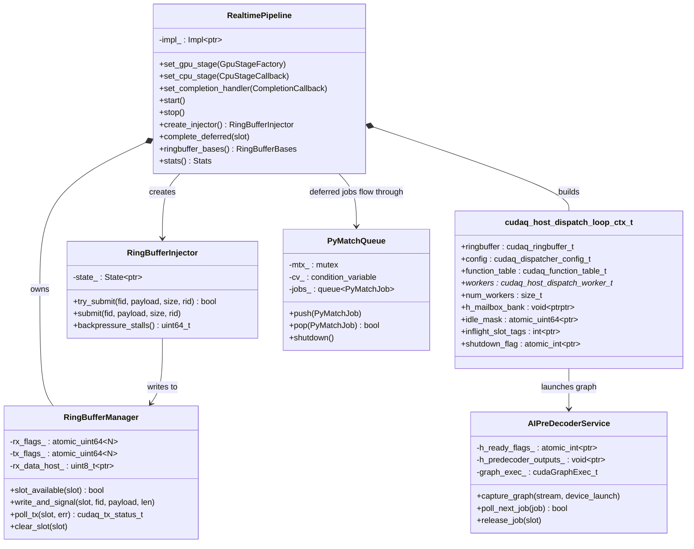
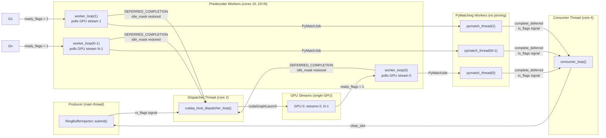
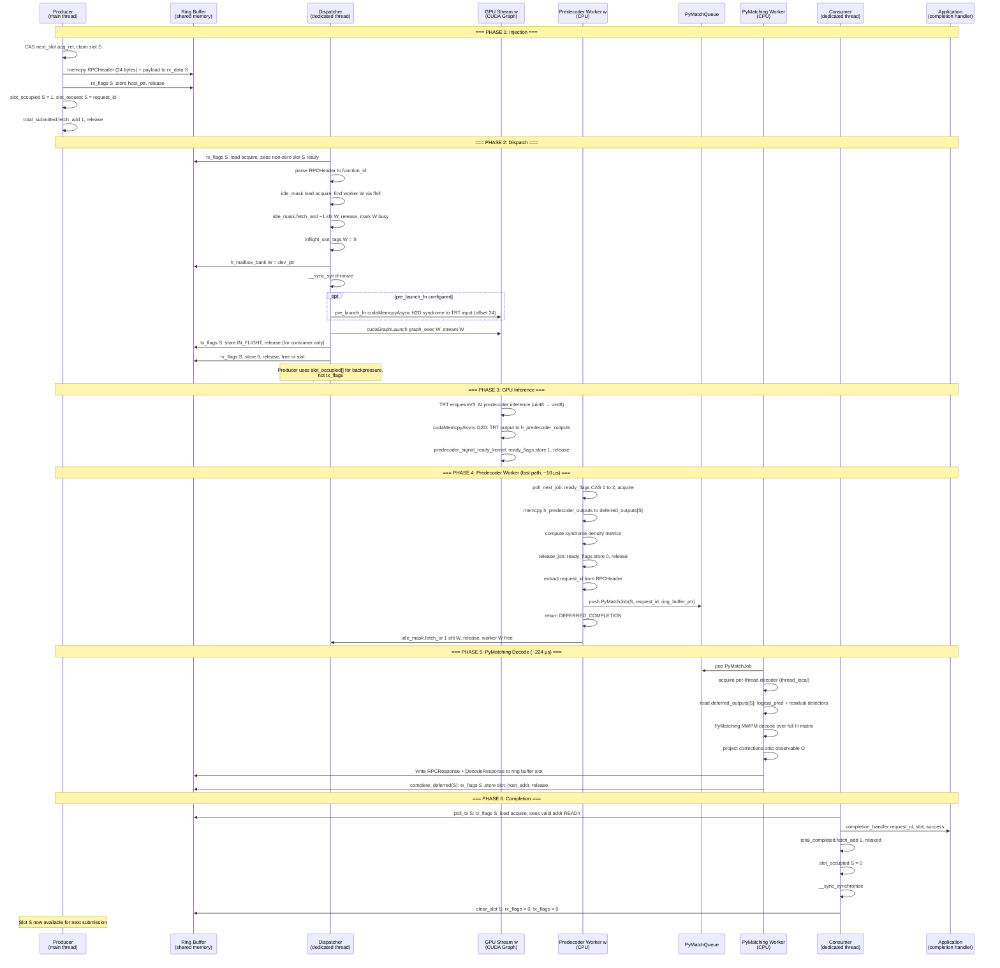
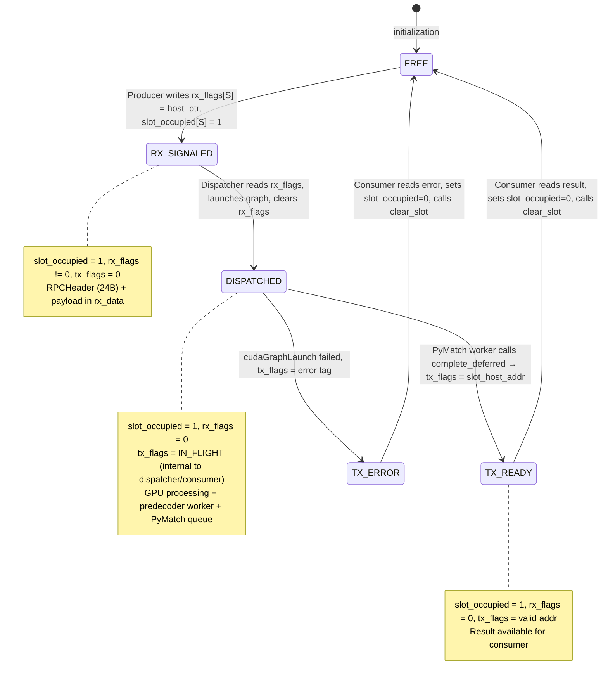
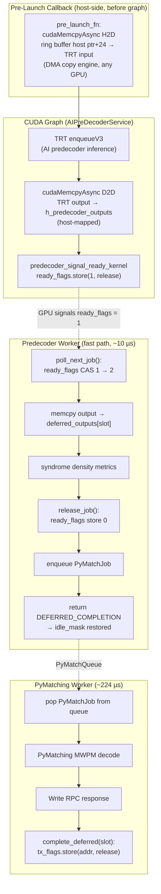
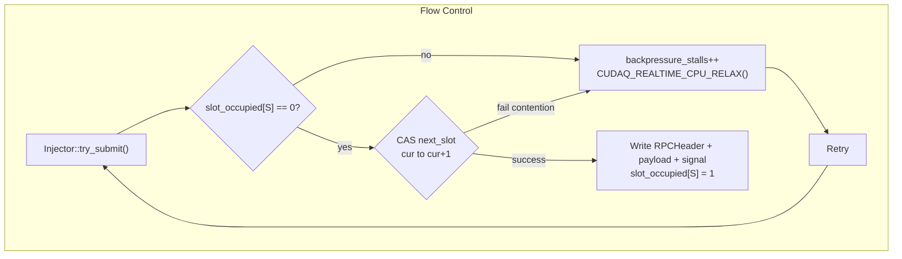
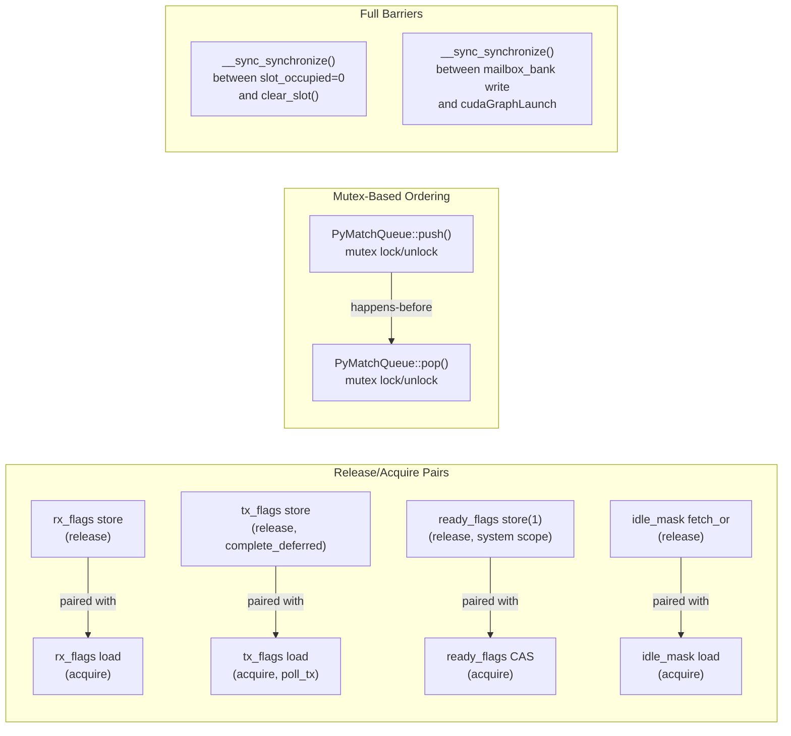
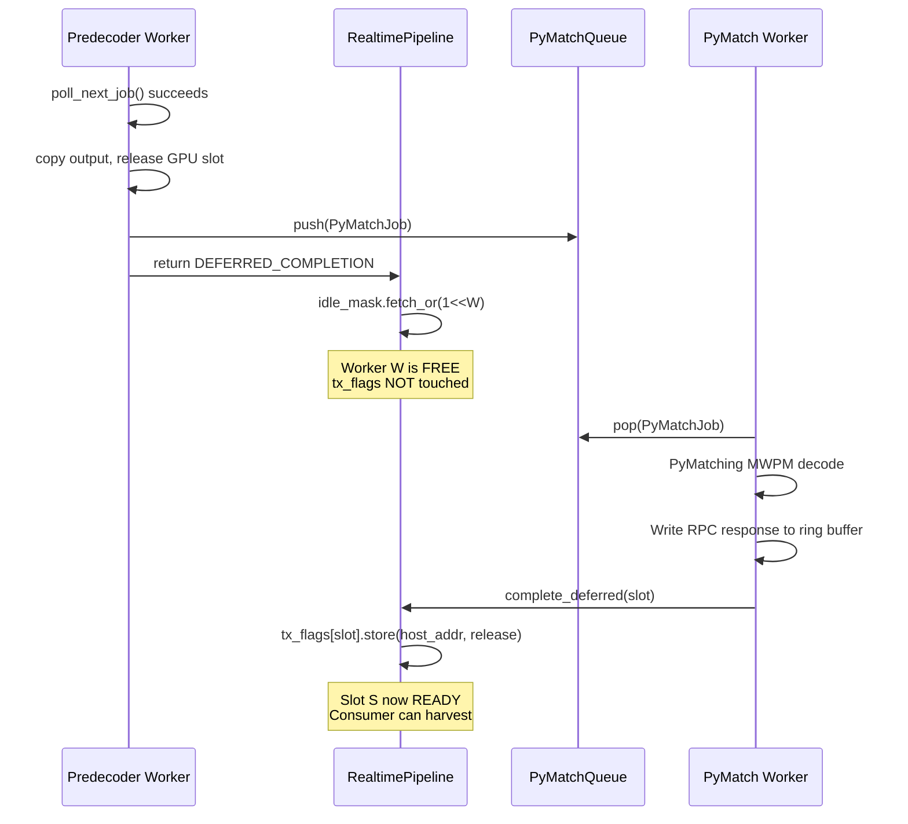

# Realtime Pipeline Architecture

## 1. Component Overview

## 2. Thread Model

The pipeline spawns four categories of threads, each pinnable to a specific CPU core:

**Thread counts (d13_r104 configuration):**
- Dispatcher: 1 thread (core 2)
- Predecoder workers: 8 threads (cores 10-17)
- PyMatching workers: 16 threads (unpinned)
- Consumer: 1 thread (core 4)
- Total: 26 threads

## 3. Sequence Diagram: Single Syndrome Through the Pipeline

This traces one syndrome request from submission to completion, showing every
atomic operation and the thread/device boundary crossings.

## 4. Atomic Variables Reference

Every atomic used in the pipeline, its scope, who writes it, who reads it,
and the memory ordering used.

### Ring Buffer Flags

| Atomic | Type | Scope | Writer(s) | Reader(s) | Ordering |
|--------|------|-------|-----------|-----------|----------|
| `rx_flags[slot]` | `cuda::atomic<uint64_t, system>` | Producer ↔ Dispatcher | Producer (signal), Dispatcher (clear), Consumer (clear) | Dispatcher (poll) | store: `release`, load: `acquire` |
| `tx_flags[slot]` | `cuda::atomic<uint64_t, system>` | Dispatcher ↔ PyMatch Worker ↔ Consumer | Dispatcher (IN_FLIGHT), PyMatch Worker (READY/addr via `complete_deferred`) | Consumer (poll). Not used for producer backpressure. | store: `release`, load: `acquire` |

### Worker Pool Scheduling

| Atomic | Type | Scope | Writer(s) | Reader(s) | Ordering |
|--------|------|-------|-----------|-----------|----------|
| `idle_mask` | `cuda::atomic<uint64_t, system>` | Dispatcher ↔ Pipeline Workers | Dispatcher (clear bit), Pipeline (set bit after DEFERRED_COMPLETION) | Dispatcher (find free worker) | fetch_and/fetch_or: `release`, load: `acquire` |

### GPU ↔ CPU Handoff (per AIPreDecoderService)

| Atomic | Type | Scope | Writer(s) | Reader(s) | Ordering |
|--------|------|-------|-----------|-----------|----------|
| `ready_flags[0]` | `cuda::atomic<int, system>` | GPU kernel ↔ Predecoder worker | GPU kernel (0→1), Worker (CAS 1→2), Worker (2→0 via release_job) | Worker (CAS poll) | store: `release`, CAS success: `acquire`, CAS fail: `relaxed` |

### Pipeline Lifecycle

| Atomic | Type | Scope | Writer(s) | Reader(s) | Ordering |
|--------|------|-------|-----------|-----------|----------|
| `shutdown_flag` | `cuda::atomic<int, system>` | Main ↔ Dispatcher | Main thread | Dispatcher loop | store: `release`, load: `acquire` |
| `producer_stop` | `std::atomic<bool>` | Main ↔ Consumer/Injector | Main thread | Consumer, Injector | store: `release`, load: `acquire` |
| `consumer_stop` | `std::atomic<bool>` | Main ↔ Consumer/Workers | Main thread | Consumer, Workers | store: `release`, load: `acquire` |
| `total_submitted` | `std::atomic<uint64_t>` | Injector ↔ Consumer | Injector | Consumer | fetch_add: `release`, load: `acquire` |
| `total_completed` | `std::atomic<uint64_t>` | Consumer ↔ Main | Consumer | Main (stats) | fetch_add: `relaxed`, load: `relaxed` |
| `backpressure_stalls` | `std::atomic<uint64_t>` | Injector ↔ Main | Injector | Main (stats) | fetch_add: `relaxed`, load: `relaxed` |
| `started` | `std::atomic<bool>` | Main thread | start()/stop() | destructor, start() | implicit seq_cst |

### Injector Slot Claiming

| Atomic | Type | Scope | Writer(s) | Reader(s) | Ordering |
|--------|------|-------|-----------|-----------|----------|
| `next_slot` | `std::atomic<uint32_t>` | Injector-internal | try_submit (CAS) | try_submit | CAS: `acq_rel` / `relaxed` |

## 5. Ring Buffer Slot State Machine

Each of the N ring buffer slots transitions through these states. The
transitions are driven by atomic flag writes from different threads.

**`tx_flags` value encoding (internal to dispatcher/consumer):**

| Value | Meaning |
|-------|---------|
| `0` | Slot is free |
| `CUDAQ_TX_FLAG_IN_FLIGHT` | Graph launched, result not yet ready |
| `CUDAQ_TX_FLAG_ERROR_TAG<<48 \| err` | ERROR — upper 16 bits = `0xDEAD`, lower 32 = cudaError_t |
| Any other non-zero | READY — value is host pointer to slot data containing result |

**Producer backpressure** uses `slot_occupied[]` (not `tx_flags`), matching the hololink model where `ring_flag`/`rx_flags` is the sole sender-side backpressure mechanism.

## 6. CUDA Graph Structure (per Worker)

Each worker has a pre-captured CUDA graph that executes on its dedicated stream.
The graph is instantiated once at startup and replayed for every syndrome.

## 7. Backpressure and Flow Control

The pipeline uses implicit backpressure through slot availability:

Backpressure uses `slot_occupied[]` (a host-side byte vector set by the producer, cleared by the consumer) rather than `tx_flags`. This matches the hololink FPGA model where the sender checks `ring_flag`/`rx_flags` for slot availability.

**Capacity:** With `num_slots = 16` and `num_workers = 8` (predecoder) + `16` (PyMatching),
up to 16 syndromes can be in various stages of processing simultaneously. When all 16
slots are occupied (either waiting for dispatch, in-flight on GPU, being decoded by
PyMatching, or awaiting consumer pickup), the injector stalls until the consumer frees a
slot.

**Round-robin limitation:** The injector uses strict round-robin slot selection. If slot N
is busy but slot N+1 is free, the producer still stalls on slot N. This preserves FIFO
ordering but contributes to backpressure stalls (~4.6M at 104 µs injection rate, single GPU).

## 8. ARM Memory Ordering Considerations

The pipeline runs on NVIDIA Grace (ARM aarch64) which has a weakly-ordered
memory model. Key ordering guarantees:

1. **Producer → Dispatcher:** `rx_flags[S].store(release)` pairs with
   `rx_flags[S].load(acquire)`. The dispatcher sees all payload bytes written
   before the flag.

2. **Dispatcher → Worker (via GPU):** The CUDA graph launch is ordered by
   `cudaGraphLaunch` semantics. The `ready_flags` store inside the GPU kernel
   uses `cuda::thread_scope_system` + `memory_order_release`, paired with the
   worker's `compare_exchange_strong(acquire)`.

3. **Predecoder Worker → PyMatch Worker:** The `PyMatchQueue` uses `std::mutex`
   + `std::condition_variable`, which provide implicit acquire/release semantics.
   The `deferred_outputs[slot]` buffer is written by the predecoder worker before
   `push()` and read by the PyMatch worker after `pop()`, so the mutex guarantees
   visibility.

4. **PyMatch Worker → Consumer:** `tx_flags[S].store(release)` in
   `complete_deferred()` pairs with `tx_flags[S].load(acquire)` in `poll_tx_flag()`.
   Consumer sees the full RPC response before the ready flag.

5. **Consumer → Producer (slot recycling):** `slot_occupied[S] = 0` followed
   by `__sync_synchronize()` (full barrier) before `clear_slot()` ensures the
   producer cannot see a free slot while the consumer is still accessing
   slot metadata.

## 9. DEFERRED_COMPLETION Protocol

The `DEFERRED_COMPLETION` mechanism allows predecoder workers to release their
GPU stream immediately while deferring ring buffer slot completion to a later
thread (the PyMatching worker pool).

**Key invariant:** Between `DEFERRED_COMPLETION` and `complete_deferred()`, the ring
buffer slot remains in the DISPATCHED state (`tx_flags = IN_FLIGHT`, `slot_occupied = 1`).
The slot's data area is safe to read/write because the consumer only harvests when
`tx_flags` transitions to a valid address, and the producer cannot reuse the slot while
`slot_occupied != 0`.
